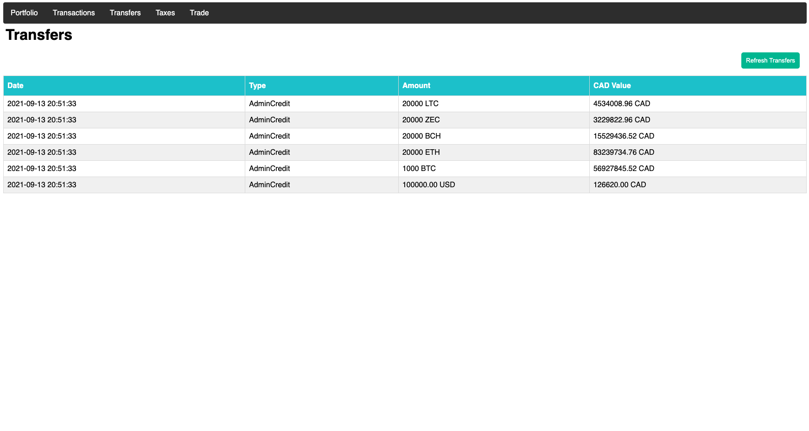
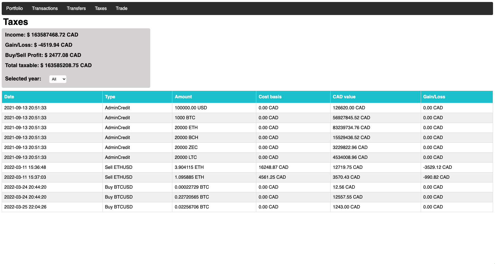

# Crypto Portfolio Tracker

This Crypto Portfolio Tracker helps you keep track of your current balances, see your transaction history, see your transfer history and make trades.

**This project is made for accounts on Gemini and the main currency used is Canadian dollars (CAD).**

## Installation and usage
- Clone this repository
```
$ git clone https://github.com/0xSP3C14LN1NJ4/CryptoPortfolioTracker.git
```

- Move into this directory
```
$ cd CryptoPortfolioTracker
```

- Generate an API Key on [Gemini](https://exchange.gemini.com/settings/api)

- Create an account on [Cryptowatch](https://cryptowat.ch) and generate an API Key

- Run the install script
```
./install.sh
```

- In `config.py`, uncomment and comment the specific lines according to the account you want to use

- Run the project by running
```
$ python3 app.py
```

## Screenshots
NOTE : Unfortunately, I do not hold this much crypto. 🥲 These are screenshots from a sandbox account. 

- Portfolio Tab


- Transactions Tab


- Transfers Tab


- Taxes Tab


- Trade Tab
 